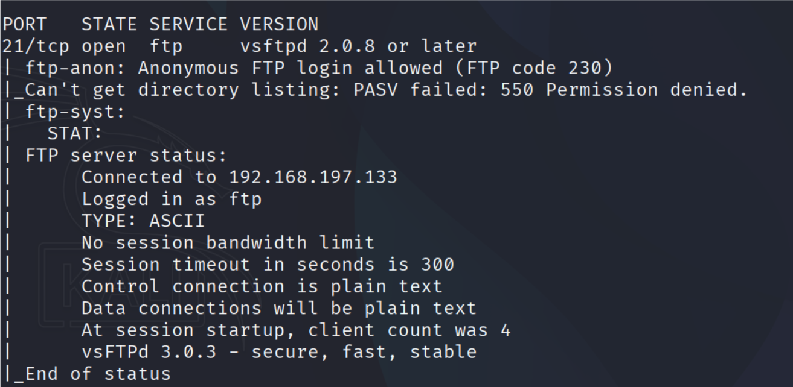
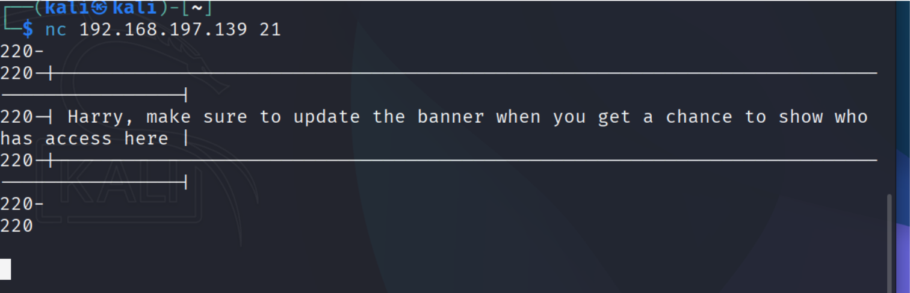
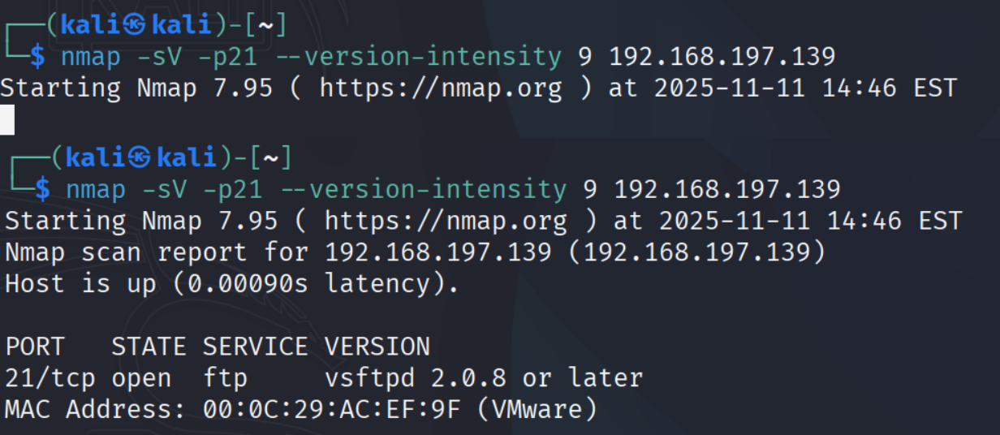

Port 21 (FTP)

Nmap suggests the service is vsFTPd 3.0.3.

Tried verifying with netcat, but it didn’t reveal more information.

Performed a deeper nmap scan, also not very helpful.

Possible exploit:
https://www.exploit-db.com/exploits/49719 (DoS)

Summary:

Host: 192.168.197.139

Port: 21

Service: FTP

Version: vsFTPd 3.0.3

Exploit: Possible Denial of Service

