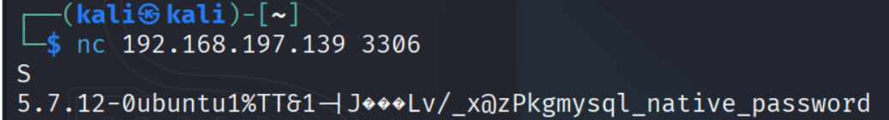

Port 3306 (MySQL)

Nmap banner reports: MySQL 5.7.12-0ubuntu1.

Confirmed with netcat.

Potential exploit:

https://www.exploit-db.com/exploits/40679 - MySQL/MariaDB/PerconaDB privilege escalation (local)

This requires local code execution.

This version is missing many critical and medium-severity patches (CVE-2016-0648 - CVE-2023-22015).

Any version earlier than 5.7.44 is considered vulnerable.

Summary:

Host: 192.168.197.139

Port: 3306

Service: MySQL

Version: 5.7.12-0ubuntu1

Potential exploit: Local privilege escalation

Recommendation: Upgrade to a supported MySQL relea
se.
