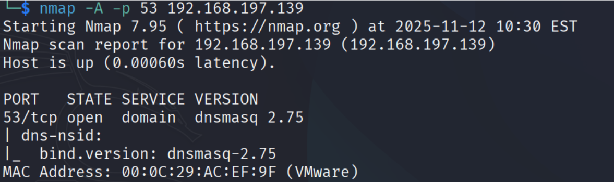
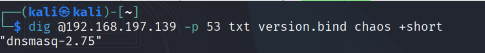

Port 53 (DNS)

Nmap identifies: dnsmasq 2.75

Confirmed with dig.

Potential exploits for dnsmasq < 2.78:
Heap Overflow
Information Leak
Mostly DoS related

Vulnerabilities include:
CVE-2017-14491–14493, CVE-2020-25681–25687, CVE-2017-13704, CVE-2022-0934.

Summary:
Date: 13.11.2025
Port: 53
Service: DNS
Version: dnsmasq 2.75
Impact: DoS vulnerabilities
Recommendation: Upgrade to dnsmasq 2.91
