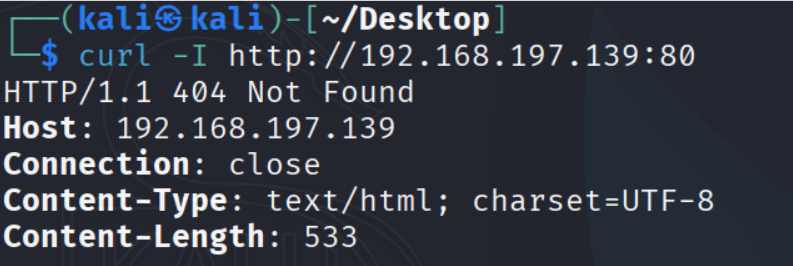

Port 80 (HTTP)

We need to check what HTTP version is running.

You can open this in a browser because it’s a command-line interface.

It appears to be a PHP command-line built-in HTTP server, typically used for local development or exposing an API/CLI tool.

80/tcp - open - http - PHP CLI server 5.5 or later

Possible exploits:

https://www.exploit-db.com/exploits/39653

PHP 5.5.33 Invalid Memory Write

https://gist.github.com/chrisjsimpson/3490250

Version from nmap: PHP CLI server 5.5 or later (unconfirmed)

Tried confirming with curl, no useful banner.

Summary:

Host: 192.168.197.139

Port: 80

Version: PHP CLI server 5.5 or later (unconfirmed)

